# Demo Rapida de GitHub Copilot

Este repositorio tiene el paso a paso para dar una demostración de GH Copilot, construyendo un bot inteligente.

El objetivo es mostrar que se pueden construir aplicaciones con inteligencia artificial generativa con GH Copilot, GH Codespaces y usando servicios PaaS de Azure, asi como enfoques que ayudan al despliegue como lo es infraestructura como codigo .

Cada sección tiene como objetivo principal mostrar una o varias Caracteristicas de GH Copilot, las cuales se especifican en cada sección, no es necesario contar con un ambiente de desarrollo porque usaremos GH Codespaces que ya tiene las extensiones y frameworks necesarios para mostrar la demo. 

La solucion final vienen el la rama finalsolution, la rama main solo contiene la guía y esta bloqueada para agregar algun cambio; sin embargo lo recomendable es crear una rama independiente y crear tu workspace (Instrucciones especificadas en la seccion de [Prerequisitos](#prerequisitos)).

A continuacion se muestra el contenido de la guía recomendada dela Demo

- [Demo Rapida de GitHub Copilot](#demo-rapida-de-github-copilot)
  - [Prerequisitos](#prerequisitos)
  - [Paso a paso](#paso-a-paso)
    - [Construcción del Bot](#construcción-del-bot)
    - [Adición de inteligencia artificial generativa usando el SDK del  Azure Open AI](#adición-de-inteligencia-artificial-generativa-usando-el-sdk-del--azure-open-ai)
    - [Integración del bot con Microsoft Teams](#integración-del-bot-con-microsoft-teams)

## Prerequisitos

Para poder ejecutar la demo es necesario seguir los siguientes pasos: 

1. Descargar e instalar el emulador de Bot Framework en la siguiente liga: https://github.com/Microsoft/BotFramework-Emulator/releases/, este es el unico componente en el equipo para mostrar que el Bot funciona correctamente.
2. Vamos al repositorio (https://github.com/demoedrmmsft/ghcopilotdemo)
3. Crear una rama en el repositorio, siguiendo los siguientes paso:
   - a. Vamos a la sección de codigo, poseriormente en el menu de ramas damos clic 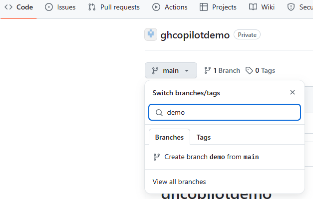
   - b. Especificamos el nombre de la rama (recomendable demo-"tualias") y del damos clic en Create branch demo-"tualias" from main 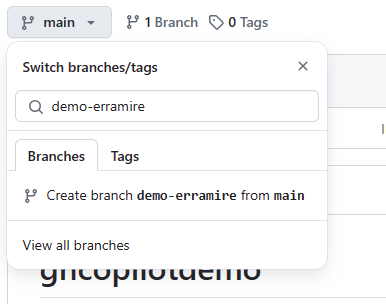
   - c. Una vez que estas en la rama recien creada le damos clic en "Code" -> En la sección de Codespaces le damos clic en el botón de "+" 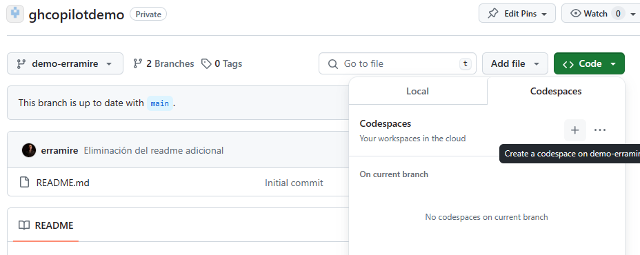
4. Puede que intente abrir con Visual Studio code si lo tienes habilitado, si no puedes usar el navegador web. En caso que no visualizar el codespace, en nuestra rama, damos clic al botón de "Code" -> Damos clien en las elipses del codespace de nuestra rama y posteriormente en la opción de "Open in Browser" 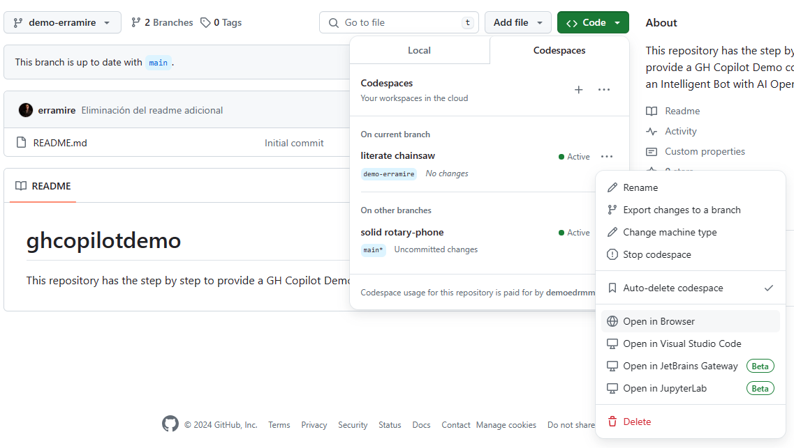 
5. Estas listo para seguir la guía y dar una excelente demostración a tu cliente

## Paso a paso

Dentro del escenario tenemos un Bot intelligente que usara Azure OpenAI para agregar inteligencia articial generativa, este Bot se podra integrar con microsoft teams y con un portal web.  

### Construcción del Bot
Una vez abierto nuestro codespace en el navegador, en esta seccion necesitamos platicar de las siguientes funcionlidades de GH Copilot: 
- Mostramos que es muy facil integrarlo en nuestro ide (Visual Studio Code):
  1. Vamos al pane lateral izquierdo y damos clic en el menu de extensiones ó con el shortcut de "Ctrl+Shift+X" 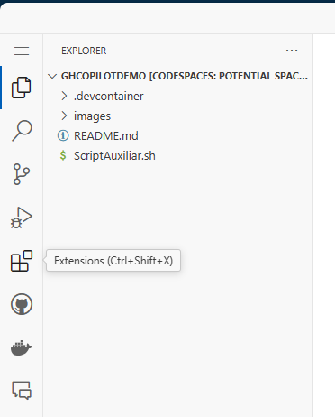
  2. En la barra de Busqueda buscamos "GitHub Copilot", y comentamos que tenemos disponible la ayuda disponible inline con GH Copilot y con un asistente Virtual con Github Copilot y esta al alcance de un clic en el boton instalar. 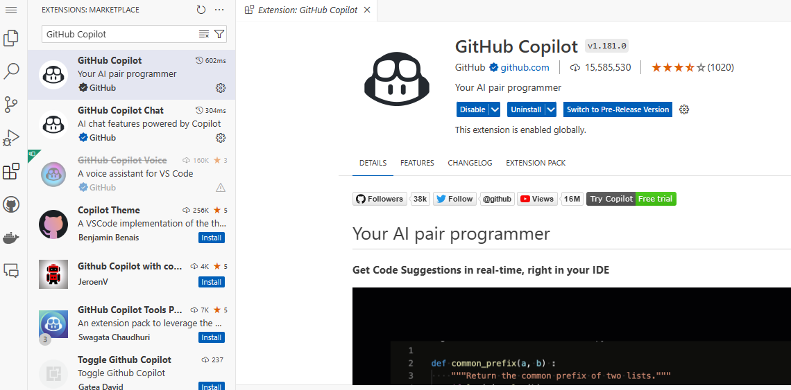
- Una vez explicado lo anterior vamos al panel lateral izquierdo y le damos clic en el menu de "Chat"; ahí explicamos que tenemos una interfaz conversacional donde podemos poner nuestros promts. 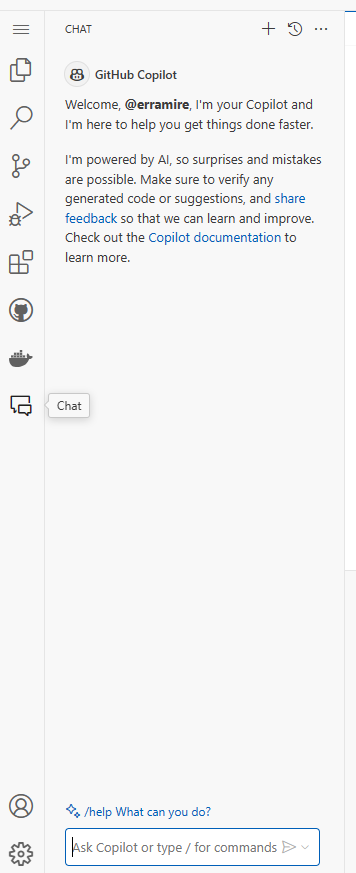

Una vez explicado esto procedemos a construir nuestro bot: 
1. En el asistente de GH Copilot escribimos el siguiente prompt: "Como desarrollador, necesito crear una aplicacion web de tipo bot en .Net Core llamada BuceoBot, donde utilice el template de EchoBot del Bot Framework de Microsoft". Si la Respuesta es similar a la siguiente imagen le damos clic en boton de thums up para indicar que lo que nos recomendo fue acertado (con eso le indicamos a GH Copilot que nos dio una respuesta correcta y en futuras interacciones no dará respuestas mas adecuadas). 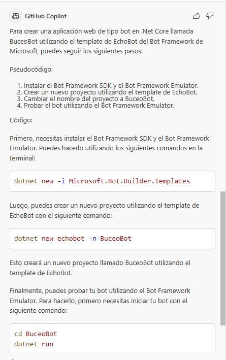
2. Es importante recalcar que la estructura del prompt anterior es del tipo "Zero Prompt", sin embargo al usar tecnicas como especificar cual es nuestro rol, expresar una acción y detallar un contexto nos permite tener respuestas mas certeras para usarlas en el desarrollo de nuestra solución. Ahora necesitamos aplicar lo que nos recomienda. Para esto vamos a instalar las platillas , abrimos una terminal en el codespace de la siguiente forma: Menu Contextual -> Terminal -> New Terminal 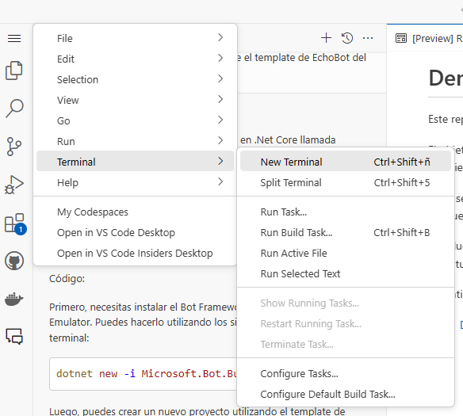
3. Posteriomente posicionamos el curson en la primera recomendación y seleccionamos la opcion de "Insert in Terminal", ejecutamos el comando. 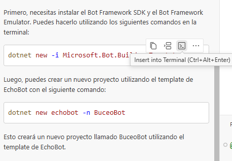
   Puede ser que falle nuestro comando. 
   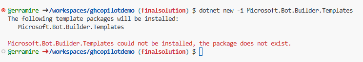
4. En dado caso que falle, una de las ventajas que tenemos es que podemos usar GH copilot, tiene la posibilidad de usar comandos para poder obtener recomendaciones para resolver un error en la terminal, en la ventana de copilot escribimos el promtp "@terminal /explain #terminalLastCommand" donde con la @ especificamos el area de trabajo que en nuestro caso es la consola, / usamos el comando para que GH Copilt nos explique porque esta mal el comando anterior y con el # especificamos que comando que en nuestro caso es el ultimo. lo cual nos ayuda a no cambiar de contexto y seguir trabajando en el IDE. 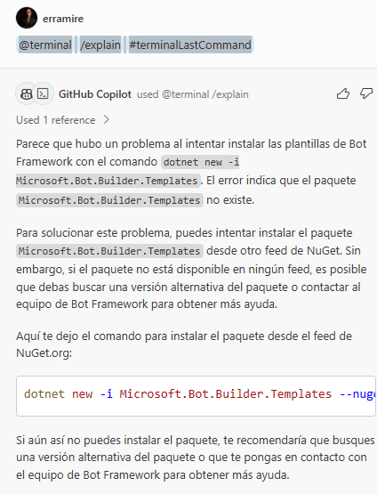
5. Aplicamos las recomendaciones e intentamos ejecutar el comando anterior y vemos que esta mal de nuevo. 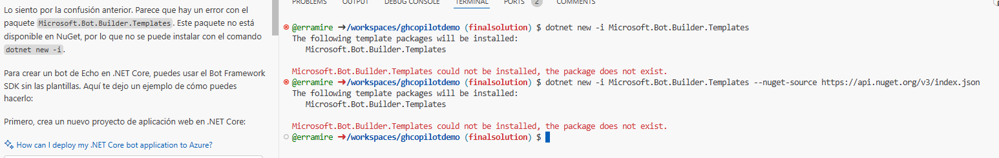
6. Es posible que ya no se encuentre este paquete por lo que vamos a cambiar nuestro prompt anterior. Necesitamos usar el template de EchoBot, por lo que necesitamos ejecutar el siguiente prompt "Como desarrollador, necesito crear una aplicacion web de tipo bot en .Net Core llamada BuceoBot, donde utilice el template de EchoBot del Bot Framework de Microsoft. El template de EchoBot para C# lo necesito instalar con el comando dotnet -i, usando dotnet new -i Microsoft.Bot.Framework.CSharp.EchoBot"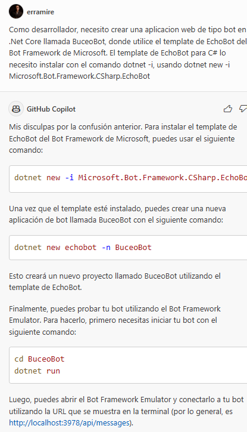
7. Seguimos las recomendaciones ejecutamos el comando 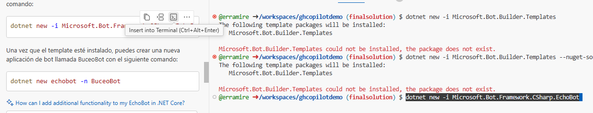
8. Creamos nuestro proyecto ejecutando el comando de creación recomendado. 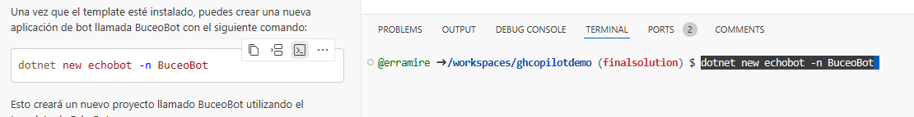
9. Nos cambiamos de repositorio y ejecutamos el proyecto. 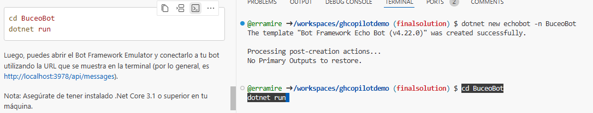
10. Si estamos en el browser, nos va a preguntar si queremos abrirlo en el browser, le damos clic 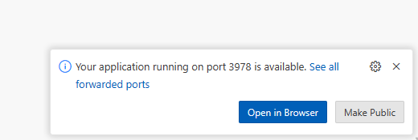
11. El api de nuestro bot esta lista. 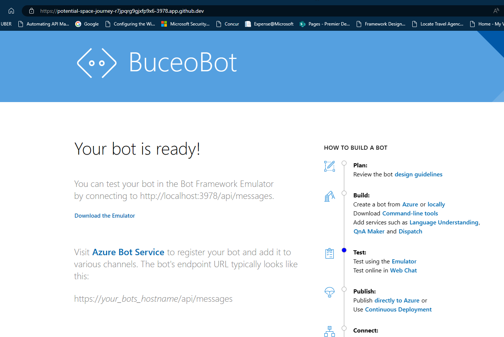
12. Ahora ya tenemos el cascaron de nuestro bot, podemos usar una funcionalidad para realizar un renombre en el archivo de BuceoBot/Bots/EchoBots.cs. Vamos entender como esta conformada esta clase. Abrimos el archivo 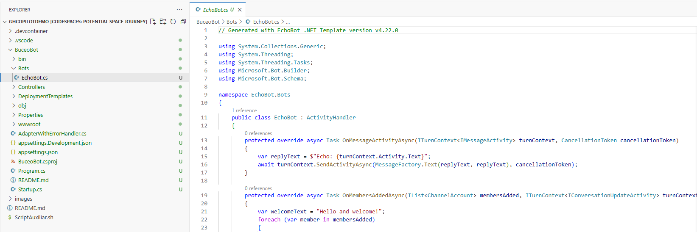
13. Puede resultar confuso si no tengo el conocimiento de como funciona un bot, por tal motivo vamos a pedirle a GH Copilot para que nos explique. Abrimos el GH Copilot Chat y con el archivo abierto escribimos @workspace /explain. 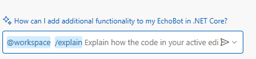
14. GH Copilot nos explica el contenido de nuestro Bot 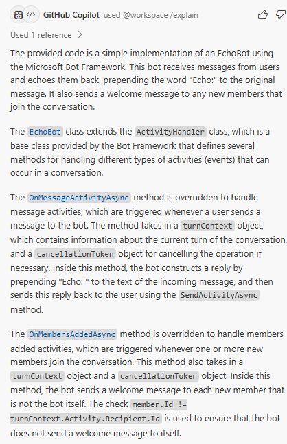
15. Pedimos a Copilot que nos ayude a renombrar EchoBot por BuceoBot, para esto escribimos el siguiente prompt "Renombrar EchoBot.cs por BuceoBot" 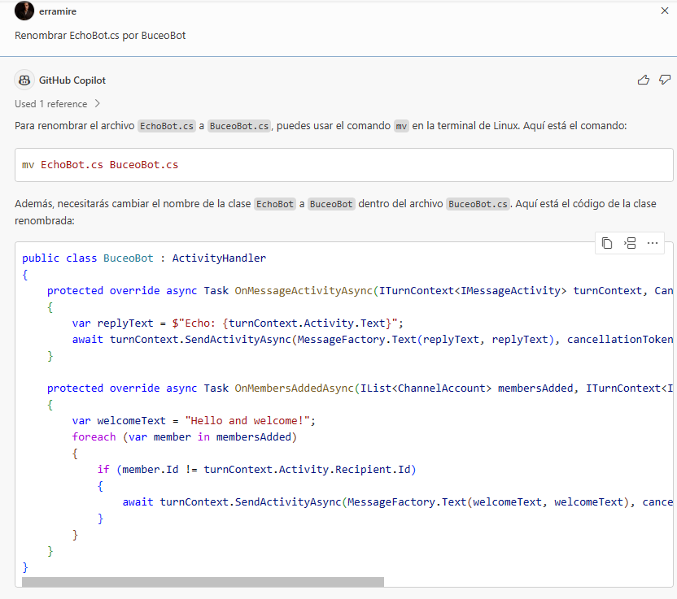
16. Seguimos el procedimietno para realizar el renombramiento de EchoBot.cs 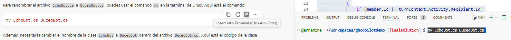
17. Cambiamos donde diga EchoBot por BuceoBot presionamos Ctrl+Shipt+H y reemplazamos 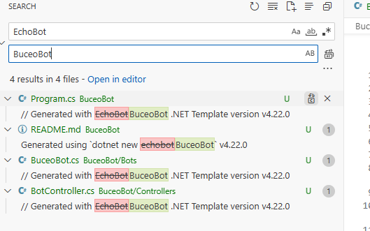  
18. Volvemos a ejecutar el bot, abrimos a la terminal y ejecutamos el siguiente comando: "dotnet run" 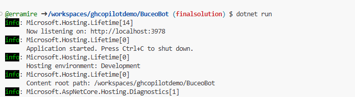
19. Nuestro bot esta listo para ser Desplegado en Azure 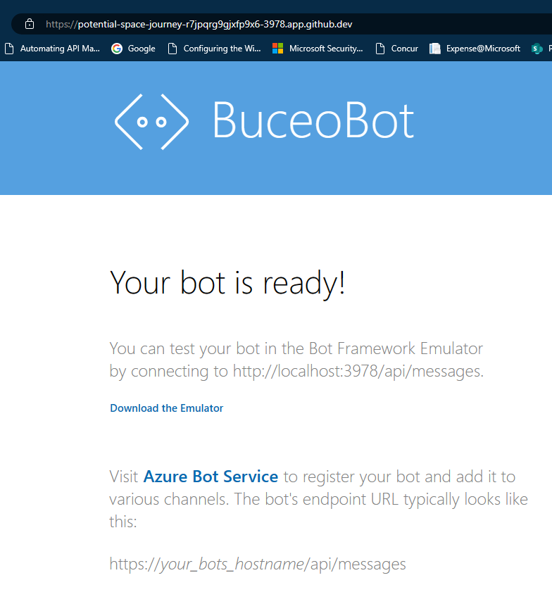
20. Ya existe un recurso de Azure Bot configurado, es necesario ir al archivo appsettings.json, e indicamos la siguiente información:
    - "MicrosoftAppType": "UserAssignedMSI",
    - "MicrosoftAppId": "82a6641b-2db0-470a-bd39-8569fb753906",
    - "MicrosoftAppPassword": "",
    - "MicrosoftAppTenantId": "fb5cf4a8-088e-4279-bda3-ff6baaae47ae"  las credenciales para realizar el despliegue.
  
   Tal y como lo vemos en la siguiente imagen 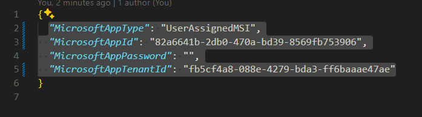

21. El proyecto ya tiene un definicion de un workflow que despliega la solucion en un Azure Bot. por lo tanto debemos ir a panel lateral izquierdo en la sección de Source Control, demos especificar el mensaje y podemos utilizar a GH Copilot para que nos recomiende una descripción 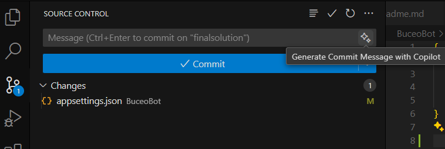
22. Una vez generado el comentario le damos clic en el Botón de "Commit" 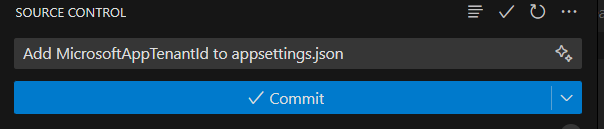
23. Sincronizamos los cambios dando clic en el botón de "Sync Changes" 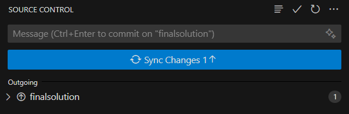
24. Al realizar esto se ejecuta el workflow que despliega la solucion usando el workflow de Github actions a los servicios de Azure. Para visalizarlo le damos clic en el proyecto de github en la seccion de Actions 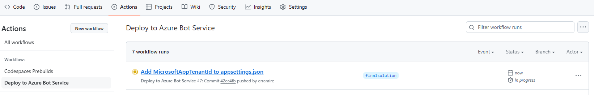
25. Para ver el detalle le damos clic en el ultimo despliegue y vemos el detalle, en nuestro caso fue exitoso. 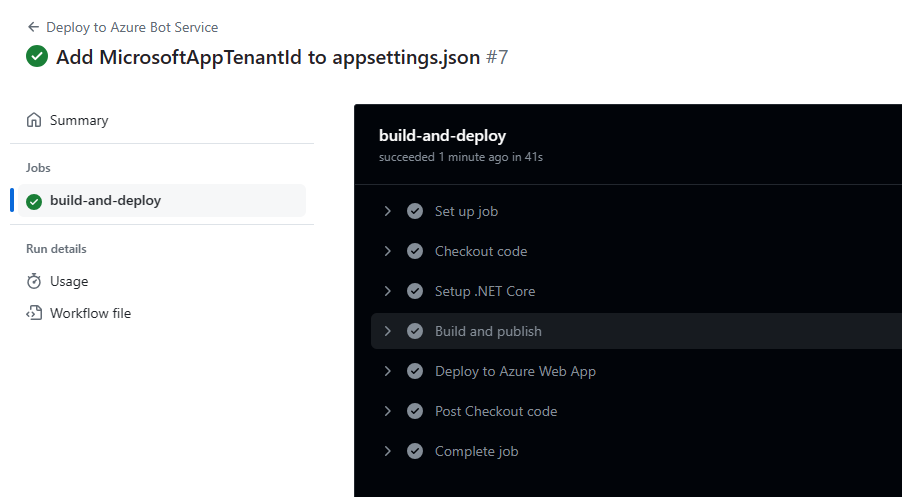 

Procedemos a hacer inteligente nuestro bot

### Adición de inteligencia artificial generativa usando el SDK del  Azure Open AI

Para este escenario necesitamos agregar inteligencia a nuestro bot, por lo que nos auxiliaremos de Github Copilot para usar Azure OpenAI para alcanzar este objetivo. 

1. Donde le vamos a agregar inteligencia es en el archivo de Bots/BuceoBot.cs, por lo que procedemos a abrirlo
2. En GH Copilot Chat indicamos el siguiente prompt : "Como instalar la libreria de Azure y Azure.AI.OpenAI", y seguimos el procedimiento indicado en la consola ( es importante que estemos en la carpeta del proyecto usando el comando "cd BuceoBot") 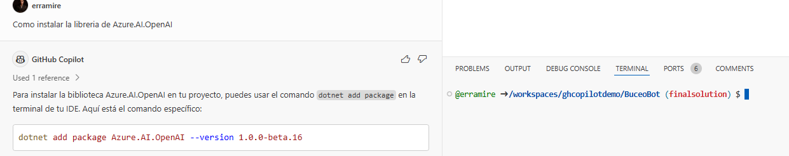
3. Vamos a usar el encadenamiento de prompts para mejorar la eficiencia de las recomendaciones del Gh Copilot in lines en los archivos que estamos trabajando.  En la linea 12 damos un salto de linea y ponemos un comentario con el siguiente prompt : "Generar 2 propiedades para la llave y el endpoint de Azure OpenAI, con un valor predeterminado"
4. Remplazamos con los siguientes valores:
   - Key de Azure OpenAI = "b605bdfb2f3945e1ba066c8359783ef5"
   - Endpoint de Azure OpenAI = "https://oaibotbuceo.openai.azure.com/"
5. Necesitamos generar un metodo para invocar a OpenAI por lo que ponemos un comentario en la linea 16 con el siguiente prompt : "#Generar un metodo asincrono que regrese un string y que reciba como parametro un texto, el metodo esta vacio" 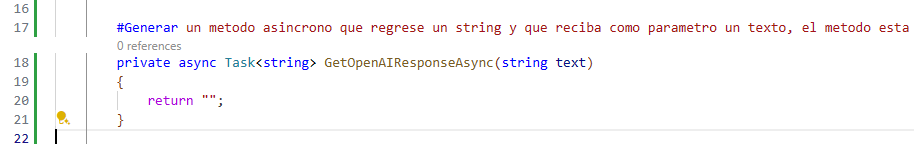
6. Damos un salto de linea en la linea 19 y escribimos el siguiente prompt como comentario para generar la llave para acceder al cliente de Azure Open AI: "#generar un AzureKeyCredential con la llave de OpenAI"
7. Damos un salto de linea y escribimos el siguiente prompt como comentario = " #inicializar el cliente de OpenAIClient con el endpoint de openai y el AzureKeyCredential" 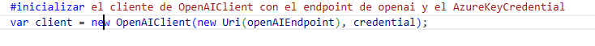
8. 

### Integración del bot con Microsoft Teams

